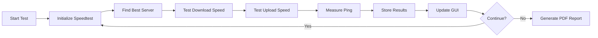

<div align="center">

# 🚀 Internet Speed Test Monitor


### 📊 Real-time Internet Speed Monitoring with Beautiful GUI & PDF Reports

[Features](#-features) • [Installation](#-installation) • [Usage](#-usage) • [Screenshots](#-screenshots) • [Tech Stack](#-tech-stack)

---

</div>

## 🎯 Overview

**Internet Speed Test Monitor** is a powerful, user-friendly desktop application that continuously monitors your internet connection speed. Built with Python and Tkinter, it provides real-time statistics, visual graphs, and exportable PDF reports to help you track and analyze your network performance over time.

<div align="center">

### ⚡ Key Highlights

🎨 **Modern Dark UI** • 📈 **Real-time Monitoring** • 📄 **PDF Export** • 🔄 **Automatic Retry** • 📊 **Visual Analytics**

</div>

---

## ✨ Features

<table>
<tr>
<td width="50%">

### 🎨 User Interface
- ✅ Modern dark-themed GUI
- ✅ Real-time statistics display
- ✅ Progress bar with live updates
- ✅ Scrollable test log
- ✅ Color-coded metrics
- ✅ Responsive design

</td>
<td width="50%">

### 📊 Analytics & Reports
- ✅ Download/Upload speed tracking
- ✅ Ping latency monitoring
- ✅ Statistical analysis
- ✅ Visual graphs (line & bar charts)
- ✅ PDF report generation
- ✅ Historical data storage

</td>
</tr>
</table>

### 🔧 Advanced Features

- 🔄 **Auto-Retry Logic**: Automatically handles connection errors with retry mechanism
- ⚙️ **Secure Mode**: Uses HTTPS for secure speed testing
- 🎯 **Rate Limiting**: Smart delays to prevent server blocking
- 💾 **Data Persistence**: Saves all test results during session
- 🖥️ **Cross-Platform**: Works on Linux, Windows, and macOS
- 📱 **Multi-threaded**: Non-blocking UI during tests

---

## 🖼️ Screenshots

### 🎨 Main Application Interface

<div align="center">


*Real-time monitoring dashboard with live statistics and intuitive control buttons*

</div>

---

### 📄 PDF Report Output

<div align="center">


*Comprehensive PDF report featuring detailed graphs and statistical analysis*

</div>

---

## 🛠️ Tech Stack

<div align="center">

| Technology | Purpose | Badge |
|------------|---------|-------|
|  | Core Language | Programming |
|  | GUI Framework | Interface |
|  | Data Visualization | Graphs |
|  | Speed Testing | Network |

</div>

### 📦 Core Libraries

```python
speedtest-cli    # Internet speed testing
matplotlib       # Graph generation and PDF export
tkinter          # GUI framework (built-in)
threading        # Concurrent test execution
```

### 🔍 How It Works



---

## 📥 Installation

### Prerequisites

- Python 3.8 or higher
- pip package manager
- Internet connection

### Step 1: Clone the Repository

```bash
git clone https://github.com/yourusername/internet-speed-test-monitor.git
cd internet-speed-test-monitor
```

### Step 2: Install Dependencies

```bash
pip install speedtest-cli matplotlib
```

**For Linux users** (if tkinter is not installed):
```bash
sudo apt-get install python3-tk
```

### Step 3: Run the Application

```bash
python main.py
```

---

## 🎮 Usage Guide

### 🚀 Quick Start

<div align="center">

| Button | Function | Description |
|--------|----------|-------------|
| 🟢 **Start** | Begin Testing | Starts continuous speed monitoring |
| 🔴 **Stop** | Halt Tests | Stops the current testing session |
| 🔄 **Reset** | Clear Data | Resets all collected data and UI |
| 📄 **Export** | Generate PDF | Creates a PDF report of test results |
| 👁️ **Show** | View PDF | Opens the generated PDF report |

</div>

### 📝 Step-by-Step Instructions

#### 1️⃣ Starting a Test Session

```
1. Launch the application
2. Click the "Start" button
3. Watch real-time statistics update
4. Monitor the test log for detailed information
```

#### 2️⃣ Viewing Results

```
• Download Speed: Displayed in Mbps (blue)
• Upload Speed: Displayed in Mbps (red)
• Ping Latency: Displayed in ms (green)
• Test Count: Shows number of completed tests
```

#### 3️⃣ Generating Reports

```
1. Stop the test session (or let it run)
2. Click "Export" to generate PDF
3. Click "Show" to open the PDF report
4. Find reports in: ./Results/speedtest_results_YYYYMMDD_HHMMSS.pdf
```

#### 4️⃣ Resetting the Session

```
1. Click "Reset" button
2. Confirm the action in dialog
3. All data will be cleared
4. Ready for a new test session
```

---

## 📊 Understanding the Results

### 📈 PDF Report Contents

The generated PDF includes four comprehensive visualizations:

1. **📉 Line Graph**: Download & Upload speeds over time
   - Blue line: Download speed trend
   - Red line: Upload speed trend
   - Dashed lines: Average values

2. **📊 Latency Graph**: Ping response times
   - Green line: Ping measurements
   - Orange dashed line: Average ping

3. **📋 Statistics Panel**: Detailed metrics
   - Total number of tests
   - Download: Avg, Max, Min speeds
   - Upload: Avg, Max, Min speeds
   - Ping: Avg, Min, Max latency

4. **📊 Bar Chart**: Visual comparison of averages

---

## 🔧 Configuration

### ⏱️ Test Intervals

Default: 30 seconds between tests. To modify:

```python
# In main.py, line ~270
time.sleep(30)  # Change this value (in seconds)
```

### 🔁 Error Handling

Default: 3 consecutive errors before stopping. To modify:

```python
# In main.py, line ~232
max_consecutive_errors = 3  # Change this value
```

### 🔒 Security Mode

The application uses secure HTTPS connections by default:

```python
st = speedtest.Speedtest(secure=True)
```

---

## 🎨 Customization

### 🎨 Color Scheme

Modify the color palette in the GUI initialization:

```python
# Button colors
bg='#27ae60'  # Green (Start button)
bg='#e74c3c'  # Red (Stop button)
bg='#e67e22'  # Orange (Reset button)
bg='#3498db'  # Blue (Export button)
bg='#9b59b6'  # Purple (Show button)
```

### 📏 Window Size

Change the default window dimensions:

```python
self.root.geometry("1000x700")  # Width x Height
```

---

## 🐛 Troubleshooting

<details>
<summary><b>❌ HTTP Error 403: Forbidden</b></summary>

**Cause**: Server rate limiting or network restrictions

**Solutions**:
- Increase wait time between tests (30+ seconds)
- Check firewall settings
- Try different network connection
- Application will auto-retry up to 3 times

</details>

<details>
<summary><b>⚠️ Locale Warnings on Linux</b></summary>

**Cause**: System locale configuration

**Solution**:
```bash
export LC_ALL=en_US.UTF-8
export LANG=en_US.UTF-8
```

</details>

<details>
<summary><b>🖼️ Tkinter Not Found</b></summary>

**Solution** (Linux):
```bash
sudo apt-get install python3-tk
```

</details>

<details>
<summary><b>📄 PDF Won't Open</b></summary>

**Cause**: No default PDF viewer

**Solutions**:
- Install a PDF viewer (evince, okular, etc.)
- Manually open PDF from Results folder
- Check file permissions

</details>

---

## 📁 Project Structure

```
internet-speed-test-monitor/
│
├── main.py                 # Main application file
├── README.md              # Project documentation
├── requirements.txt       # Python dependencies
├── .gitignore            # Git ignore rules
│
├── Results/              # PDF reports directory
│   └── speedtest_results_YYYYMMDD_HHMMSS.pdf
│
└── screenshots/          # Application screenshots
    ├── main_interface.png
    └── pdf_output.png
```

---

## 🔮 Future Enhancements

- [ ] 📊 Real-time graph updates in GUI
- [ ] 💾 Export to CSV/JSON formats
- [ ] 📧 Email notifications for poor speeds
- [ ] 🌐 Multiple server selection
- [ ] 📱 Mobile app version
- [ ] ☁️ Cloud storage integration
- [ ] 🔔 Desktop notifications
- [ ] 📈 Advanced analytics dashboard
- [ ] 🎯 Speed threshold alerts
- [ ] 📅 Scheduled testing

---

## 🤝 Contributing

Contributions are welcome! Here's how you can help:

1. 🍴 Fork the repository
2. 🔨 Create a feature branch (`git checkout -b feature/AmazingFeature`)
3. 💾 Commit your changes (`git commit -m 'Add some AmazingFeature'`)
4. 📤 Push to the branch (`git push origin feature/AmazingFeature`)
5. 🎉 Open a Pull Request

### 📋 Contribution Guidelines

- Follow PEP 8 style guide
- Add comments for complex logic
- Update README for new features
- Test on multiple platforms

---

## 📜 License

This project is licensed under the MIT License - see the [LICENSE](LICENSE) file for details.

```
MIT License

Copyright (c) 2025 Your Name

Permission is hereby granted, free of charge, to any person obtaining a copy
of this software and associated documentation files (the "Software"), to deal
in the Software without restriction...
```

---

## 👨‍💻 Author

<div align="center">

**Your Name**

[](https://github.com/yourusername)
[](https://linkedin.com/in/yourprofile)
[](mailto:your.email@example.com)

</div>

---

## 🙏 Acknowledgments

- **speedtest-cli** - For the amazing speed testing library
- **matplotlib** - For powerful visualization capabilities
- **Python Community** - For continuous support and inspiration
- **Contributors** - Thank you to all who have contributed!

---

## 📊 Project Stats

<div align="center">


</div>

---

## 💡 Tips & Best Practices

1. **🔄 Regular Monitoring**: Run tests at different times of day for comprehensive analysis
2. **📊 Long-term Tracking**: Keep historical PDFs to track ISP performance over months
3. **⚡ Network Optimization**: Use results to identify optimal usage times
4. **🛠️ Troubleshooting**: Compare results before/after router changes
5. **📱 Multiple Devices**: Run on different devices to compare performance

---

<div align="center">

### ⭐ If you find this project useful, please consider giving it a star!

Made with ❤️ and Python

**[⬆ Back to Top](#-internet-speed-test-monitor)**

---


</div>